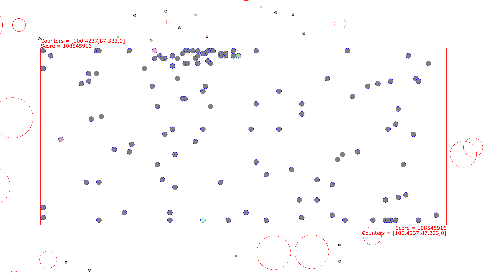
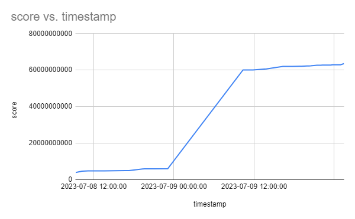
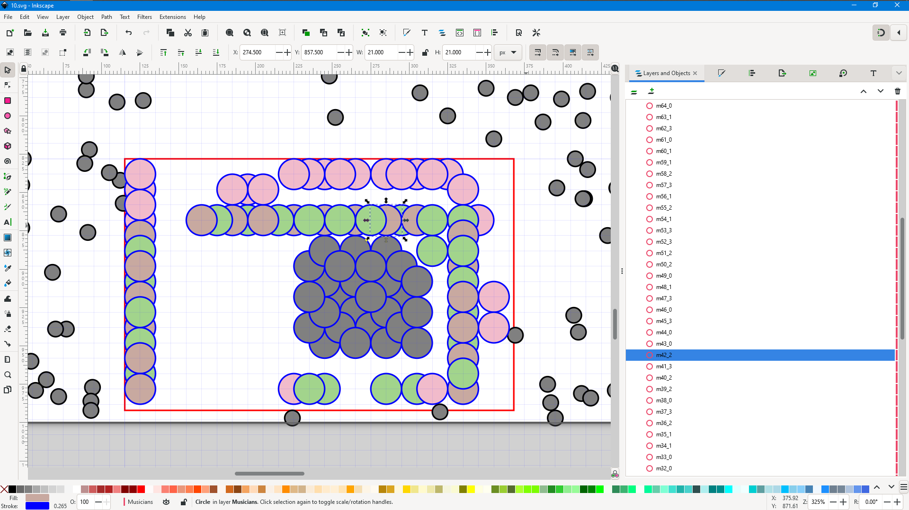

# ICFP 2023 writeup for uguu.org

I spent ~42 hours randomly placing musicians on stage for [ICFP 2023](https://icfpcontest.com/).  I had a good time.

This year's task involves placing musicians on stage to maximize enjoyment for the attendees, while satisfying these constraints:

- Musicians must be some distance apart.
- Musicians must be on stage, and at some distance away from the edges of the stage.
- Enjoyment for each attendee is correlated with their taste for each musician's instrument and distance to each musician.
- Musicians and pillars along the line of sight from attendees and other musicians will block the effect of anything behind them.
- Bonus extensions: effect of each musician is amplified by closeness to other musicians with the same instrument, and per-musician volume control is available.

The blocking constraint was the one feature that made it difficult, for which I had no good ideas.  In times of not knowing what to do, the usual strategy is to do random things, or solve the problem manually.

# Random placements

I basically did one thing this year, and that is to just do random things and hope for the best.  I might have said this was inspired by genetic algorithms, but it was more driven by blind intuitions rather than sound principles.  Basically:

0. Start with random placements, with minor adjustments to nudge musicians toward or away from attendees based on sum of influences.
1. Divide musicians into groups.
2. Move each group randomly.
3. For the group that show the most promise, divide it again and repeat.
4. Reset group selection when we ran out of groups.
5. If we stopped seeing score improvements, restart the whole process all the way back to the random placements.

To satisfy the minimum distance constraints, I placed all musicians on a rectangular grid.  This means I lost a fair bit of precision and there are many positions that were not explored, but in exchange I was able to test for collisions fast and not run into any floating point woes.

To iterate quickly, I only score musicians with respect to the top few attendees, sorted mostly by distance.  Because effect of each musician diminishes greatly with distance, I found that attendees way out in the back mostly don't matter.  This optimization is not entirely sound, but because my random placements are so dodgy anyways, increasing the scoring accuracy didn't really matter.  By the way, I never matched the judges' scoring function exactly, but got close enough for most problems that I didn't bother digging deeper.

This one strategy landed me in the middle of the rankings, where I remained throughout the contest.  You can see from this graph that my scores were mostly constant, except that one time when I cranked the volumes up to 10.

# Manual solution

Following best practice from previous years, I cached all previous solutions and only replaced them if the score improved.  The cache had two parts: JSON files for submission, and SVG files for visualization.  Since I had the SVGs, I thought I could try to place the musicians manually by editing the SVGs in Inkscape and then converting those back to JSON.

I had all the scripts to make this work, but immediately gave up after spending a few minutes doing manual placements for problem 10.

# Closing thoughts

For the most part, I didn't make any drastic changes other than tweaking the randomization parameters and keeping the random solver running.  I tried to get rid of the rectangular grid pretty late on day 3 but couldn't quite get that to work, and found that by not using grid-aligned placements, the musicians tend to be further away from edges of the stage where they could deliver most impact, so I gave up on that.

On the other hand, there weren't anything that I really wanted to try but didn't, so I have relatively few regrets this year :)

This has been a great contest.  The problem was concise but still has depth, and the backward-compatible problem extensions were greatly appreciated.  Many thanks to the organizers for another great year.
